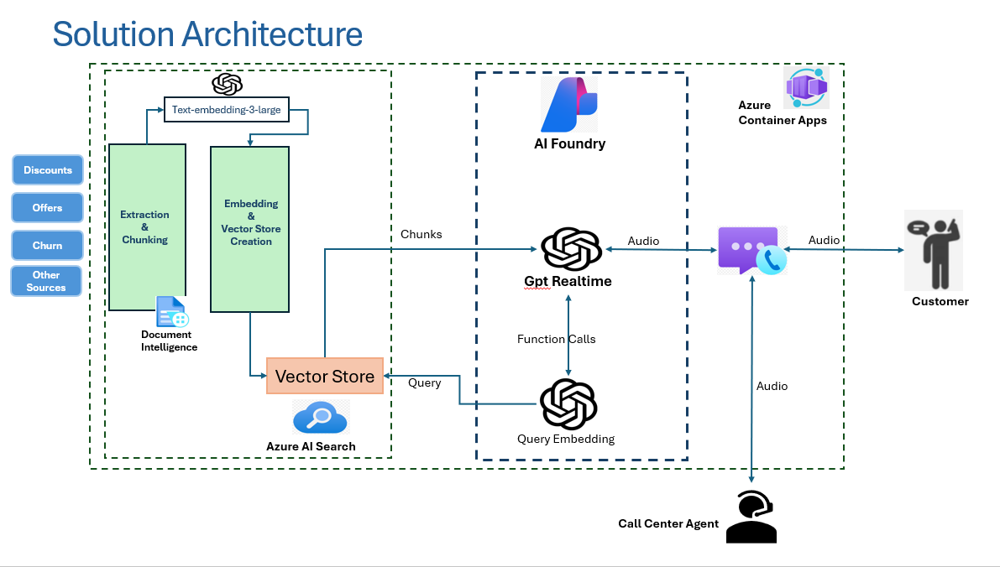

|page_type| languages                               |products
|---|-----------------------------------------|---|
|sample| <table><tr><td>Python</tr></td></table> |<table><tr><td>azure</td><td>azure-communication-services</td></tr></table>|

# VoiceRAG Using OpenAI RealtimeAPI and Azure Communication Service (ACS)

In this solution demonstrates how you can use ACS's Call Automation SDK to make an outbound call to a phone number and do Voice RAG using OpenAI RealtimeAPI and Azure AI Search

## Table of Contents

* [Features](#features)
* [Design](#design)
* [Prerequisites](#prerequisites)
* [Setup the Python environment](#setup-the-python-environment)
* [Configuring application](#configuring-application)
* [Run app locally](#run-app-locally)
  * [Expose local server using ngrok (for callbacks)](#expose-local-server-using-ngrok-for-callbacks)
  * [Optional: Run with Docker locally](#optional-run-with-docker-locally)
* [Deploy to Azure Container Apps](#deploy-to-azure-container-apps)
* [Verification Checklist](#verification-checklist)
* [Next Steps](#next-steps)

## Features

* **Voice interface**: The app initiates an outbound call to the user provided phone number using Azure Communication Services(ACS).  
It captures voice input from the phone and sends it to the backend where it is processed by the Azure OpenAI GPT-4o Realtime API.
* **RAG (Retrieval Augmented Generation)**: The app uses the Azure AI Search service to answer questions about a knowledge base, and sends the retrieved documents to the GPT-4o Realtime API to generate a response.
* **Audio output**: The app sends the response from the GPT-4o Realtime API as audio to ACS bi-directional channel and the message gets played on the user's phone.

# Design



## Prerequisites

* An Azure account with an active subscription. [Create an account for free](https://azure.microsoft.com/free/?WT.mc_id=A261C142F). 
* An Azure Communication Services (ACS) resource. [Create one](https://docs.microsoft.com/azure/communication-services/quickstarts/create-communication-resource).
* An [ACS phone number](https://learn.microsoft.com/en-us/azure/communication-services/quickstarts/telephony/get-phone-number) capable of outbound calling (not available in free subscriptions).
* Azure AI (Azure OpenAI) resource & deployment (GPT‑4o Realtime) + API key.
* Azure AI Search service with an index containing your knowledge base content.
* Public callback URL for local development using either:
  * **ngrok** (documented below)
* [Python](https://www.python.org/downloads/) 3.12 or above.
* (Optional) Docker & Azure CLI for containerized / Azure Container Apps deployment.

### Setup the Python environment

Create and activate a virtual environment, then install dependencies.

PowerShell (Windows):
```
python -m venv .venv
. .\.venv\Scripts\Activate.ps1
pip install -r requirements.txt
```

macOS / Linux:
```
python3 -m venv .venv
source .venv/bin/activate
pip install -r requirements.txt
```


### Configuring application

Copy the provided sample and fill in your values:

```
cp .env.sample .env   # then edit .env with your values
```

> **Never commit `.env`** — it contains secrets. The `.env.sample` file is safe to commit.

| Variable | Description |
|----------|-------------|
| `AZURE_OPENAI_ENDPOINT` | Azure OpenAI endpoint. |
| `AZURE_OPENAI_REALTIME_DEPLOYMENT` | GPT‑4o Realtime deployment name. |
| `AZURE_OPENAI_API_VERSION` | API version (e.g. 2024-10-01-preview). |
| `ACS_CONNECTION_STRING` | ACS connection string. |
| `ACS_PHONE_NUMBER` | ACS acquired phone number (E.164, e.g. +1425XXXXXXX). |
| `ACS_WEBSOCKET_URL` | ACS media streaming WebSocket URL (bi-directional). |
| `CALLBACK_URI_HOST` | Public base URL (ngrok / dev tunnel / container app FQDN). No trailing slash. |
| `COGNITIVE_SERVICES_ENDPOINT` | Cognitive Services endpoint for speech. |
| `AZURE_SEARCH_ENDPOINT` | Azure AI Search endpoint. |
| `AZURE_SEARCH_API_KEY` | Azure AI Search key (admin or query). |
| `AZURE_SEARCH_INDEX` | Index name containing chunked content. |
| `AZURE_SEARCH_SEMANTIC_CONFIGURATION` | (Optional) Semantic configuration name. |
| `AZURE_SEARCH_IDENTIFIER_FIELD` | (Default: chunk_id) Unique id field. |
| `AZURE_SEARCH_CONTENT_FIELD` | (Default: chunk) Content/body field. |
| `AZURE_SEARCH_TITLE_FIELD` | (Default: title) Title field. |
| `AZURE_SEARCH_EMBEDDING_FIELD` | (Default: text_vector) Vector embedding field. |
| `AZURE_SEARCH_USE_VECTOR_QUERY` | true/false to enable vector + hybrid search. |
| `TARGET_PHONE_NUMBER` | (Optional) Default target phone number (overridden via UI). |
| `LIVE_AGENT_PHONE_NUMBER` | (Optional, default: +19722135344) Phone number for live agent transfers. |

> Ensure your Azure AI Search index is already populated (ingestion scripts are not part of this repo).


## Run app locally

1. Start the Application:
```
python app.py
```

2. Open `http://localhost:8080/` (or your tunnel URL once configured).
3. Start ngrok tunnel for call back: 
```
ngrok http 8080
```
4. Enter the destination phone number and click `Make Outbound Call`.

### Expose local server using ngrok (for callbacks)

1. Install: https://ngrok.com/download
2. Auth (once):
```
ngrok config add-authtoken <your-token>
```
3. Start tunnel:
```
ngrok http 8080
```
4. Copy the HTTPS Forwarding URL (e.g. `https://abcd1234.ngrok.io`) and set in `.env`:
```
CALLBACK_URI_HOST=https://abcd1234.ngrok.io
```
5. Restart the app so ACS callbacks use the public URL.


### Optional: Run with Docker locally

```
docker build -t voicerag:latest .
docker run --env-file .env -p 8080:8080 voicerag:latest
```
Then (if needed) tunnel the container:
```
ngrok http 8080
```

## Deploy to Azure Container Apps

Prerequisites: Azure CLI installed & logged in (`az login`). Ensure `containerapp` extension is installed (`az extension add --name containerapp`).

Deploy (replace placeholders):
```
az containerapp up \
  --resource-group <resource-group-name> \
  --name <container-app-name> \
  --ingress external \
  --target-port 8080 \
  --source .
```

## Verification Checklist

| Step | Expectation |
|------|-------------|
| App starts | `INFO:voicerag` logs display without stack traces |
| Web UI loads | Page available at localhost/tunnel/container FQDN |
| Outbound call placed | Phone rings after clicking the button |
| Audio round-trip | AI responses logged (AI:--) and heard on call |
| RAG tool usage | Search tool invoked before answers |


## Next Steps
* Add ingestion scripts to load documents into Azure AI Search.
* Integrate logging / metrics (Azure Monitor, App Insights).
* Secure endpoints (auth, rate limiting, IP restrictions).
* Add CI/CD and IaC (Bicep/Terraform) for reproducible environments.
